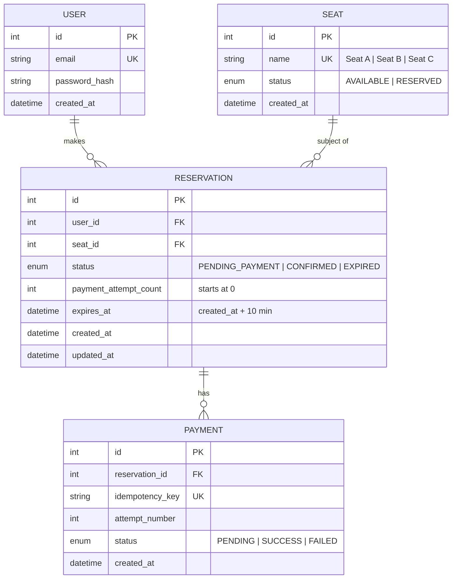

# Data Model — Public Seat Reservation Platform

## ERD



---

## Entity Schemas

### `users`

| Column | Type | Constraints | Notes |
|---|---|---|---|
| `id` | INT | PK, AUTO_INCREMENT | |
| `email` | VARCHAR(255) | UNIQUE, NOT NULL | Login identifier |
| `password_hash` | VARCHAR(255) | NOT NULL | bcrypt hash |
| `created_at` | DATETIME | NOT NULL, DEFAULT NOW() | |

**Seed data:** 3 test users with known credentials.

---

### `seats`

| Column | Type | Constraints | Notes |
|---|---|---|---|
| `id` | INT | PK, AUTO_INCREMENT | |
| `name` | VARCHAR(50) | UNIQUE, NOT NULL | "Seat A", "Seat B", "Seat C" |
| `status` | ENUM | NOT NULL, DEFAULT 'AVAILABLE' | `AVAILABLE \| RESERVED` |
| `created_at` | DATETIME | NOT NULL, DEFAULT NOW() | |

**Denormalization note:** `seat.status` is a derived value (it mirrors whether an active `CONFIRMED` or `PENDING_PAYMENT` reservation exists). It is kept here as a denormalized column for fast reads and updated atomically within the same transaction as reservation writes. This avoids a JOIN on every seat list query.

**Seed data:** 3 rows — Seat A, Seat B, Seat C — all `AVAILABLE`.

---

### `reservations`

| Column | Type | Constraints | Notes |
|---|---|---|---|
| `id` | INT | PK, AUTO_INCREMENT | |
| `user_id` | INT | FK → users.id, NOT NULL | |
| `seat_id` | INT | FK → seats.id, NOT NULL | |
| `status` | ENUM | NOT NULL, DEFAULT 'PENDING_PAYMENT' | `PENDING_PAYMENT \| CONFIRMED \| EXPIRED` |
| `payment_attempt_count` | INT | NOT NULL, DEFAULT 0 | Incremented on each `/api/payments` POST |
| `expires_at` | DATETIME | NOT NULL | Set to `created_at + 10 minutes` at insert time |
| `created_at` | DATETIME | NOT NULL, DEFAULT NOW() | |
| `updated_at` | DATETIME | NOT NULL, DEFAULT NOW(), ON UPDATE NOW() | |

**Constraints:**
- A `user_id` may only have one active (`PENDING_PAYMENT`) reservation at a time. Enforced at the usecase level (not a DB unique constraint, to allow historical records).
- `seat_id` + `status IN ('PENDING_PAYMENT', 'CONFIRMED')` should never have more than 1 row — enforced by `SELECT FOR UPDATE` in `CreateReservationUsecase`.

**Future state:** A `CANCELLED` terminal status can be added without schema changes — just add the enum value and the cancellation usecase.

---

### `payments`

| Column | Type | Constraints | Notes |
|---|---|---|---|
| `id` | INT | PK, AUTO_INCREMENT | |
| `reservation_id` | INT | FK → reservations.id, NOT NULL | |
| `idempotency_key` | VARCHAR(36) | UNIQUE, NOT NULL | UUID generated server-side per POST request |
| `attempt_number` | INT | NOT NULL | Mirrors `reservation.payment_attempt_count` at time of attempt |
| `status` | ENUM | NOT NULL | `PENDING \| SUCCESS \| FAILED` |
| `created_at` | DATETIME | NOT NULL, DEFAULT NOW() | |

**Idempotency:** `idempotency_key` is unique. On retry, the client sends back the key from a previous failed response. The usecase checks for an existing record with that key and returns the cached result without re-running payment logic.

**Audit trail:** Every attempt (including failures) is persisted. This gives a full history: attempt 1 → FAILED, attempt 2 → SUCCESS.

---

## Key Invariants

| # | Invariant | Enforced by |
|---|---|---|
| 1 | A seat cannot be double-reserved | `SELECT FOR UPDATE` in `CreateReservationUsecase` |
| 2 | A user cannot hold two `PENDING_PAYMENT` reservations | Usecase assertion before insert |
| 3 | Payment attempt 1 always fails | `payment_attempt_count` check in `ProcessPaymentUsecase` |
| 4 | Retrying with the same idempotency key returns the same result | Unique `idempotency_key` lookup before processing |
| 5 | Expired reservations release their seat atomically | Single transaction in `ExpireReservationsUsecase` |
| 6 | `seat.status` always matches active reservation state | Updated in the same transaction as reservation writes |

---

## Prisma Schema (draft)

```prisma
model User {
  id           Int           @id @default(autoincrement())
  email        String        @unique
  passwordHash String        @map("password_hash")
  createdAt    DateTime      @default(now()) @map("created_at")
  reservations Reservation[]

  @@map("users")
}

model Seat {
  id           Int           @id @default(autoincrement())
  name         String        @unique
  status       SeatStatus    @default(AVAILABLE)
  createdAt    DateTime      @default(now()) @map("created_at")
  reservations Reservation[]

  @@map("seats")
}

model Reservation {
  id                  Int               @id @default(autoincrement())
  userId              Int               @map("user_id")
  seatId              Int               @map("seat_id")
  status              ReservationStatus @default(PENDING_PAYMENT)
  paymentAttemptCount Int               @default(0) @map("payment_attempt_count")
  expiresAt           DateTime          @map("expires_at")
  createdAt           DateTime          @default(now()) @map("created_at")
  updatedAt           DateTime          @updatedAt @map("updated_at")
  user                User              @relation(fields: [userId], references: [id])
  seat                Seat              @relation(fields: [seatId], references: [id])
  payments            Payment[]

  @@map("reservations")
}

model Payment {
  id             Int           @id @default(autoincrement())
  reservationId  Int           @map("reservation_id")
  idempotencyKey String        @unique @map("idempotency_key")
  attemptNumber  Int           @map("attempt_number")
  status         PaymentStatus @default(PENDING)
  createdAt      DateTime      @default(now()) @map("created_at")
  reservation    Reservation   @relation(fields: [reservationId], references: [id])

  @@map("payments")
}

enum SeatStatus {
  AVAILABLE
  RESERVED
}

enum ReservationStatus {
  PENDING_PAYMENT
  CONFIRMED
  EXPIRED
}

enum PaymentStatus {
  PENDING
  SUCCESS
  FAILED
}
```
